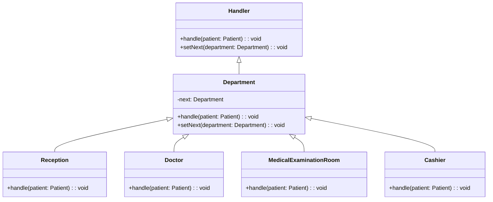

# Chain of Responsibility Pattern

## Description

Chain of Responsibility (COR) is a behavioral design pattern that lets you pass requests along a chain of handlers. Upon receiving a request, each handler decides either to process the request or to pass it along the chain.

For example, you can add authentication, authorization, validation, caching, in that order, to a request. Each handler can either process the request or pass it to the next handler in the chain. This is bloated and bad.

COR transforms behaviors into stand-alond `handlers` which all implement `handle(req)`. Each handler has a reference to the next handler in the chain and can pass the `req` to the next handler. Any handler can also choose to stop the chain.

Another implementation of COR is that any handler that can process the request, does so, and ends the chain. So either one handler processes the request or none do. 

One can provide setters for the reference to insert, remove, skip, reorder handlers dynamically. 

Can be used with [Composite](/design-patterns/structural/composite.md) to create a tree of handlers.

COR differs from [Decorator](/design-patterns/structural/decorator.md) in that decorators aren't allowed to break the chain/flow. Also COR can execute totally arbitrary logic, while decorators are (generally more) limited to the same interface.

## Benefits

1. Use COR when you have to process requests in multiple ways, but don't know the processing order.
2. **Open/Closed Principle**: You can introduce new handlers into the app without breaking the existing client code.

## Example

Let's say you have a hospital with departments: `Reception`, `Doctor`, `MedicalExaminationRoom` and `Cashier`. When a patient comes they go through this order respectively.

In this example:

- The departments are all `handlers` that implement the `handle(patient)` method and `setNext(department)` method.
- The `Hospital` is the client that sends the patient to the first department.

## Implementation

- `Handler` is the abstract interface that represents the handler.
- `Department` is the interface the base handler.
- `Reception`, `Doctor`, `MedicalExaminationRoom`, and `Cashier` are the classes that represent the handlers.
- `Hospital` is the class that represents the client.

### Diagram



### Code Implementation

=== "Python"
    ```python
    --8<-- "code/design-patterns/behavioral/chain-of-responsibility/python/chain_of_responsibility.py"
    ```

=== "Go"
    ```go
    --8<-- "code/design-patterns/behavioral/chain-of-responsibility/go/chain_of_responsibility.go"
    ```

### Code Usage

=== "Python"
    ```python
    --8<-- "code/design-patterns/behavioral/chain-of-responsibility/python/chain_of_responsibility_usage.py"
    ```

=== "Go"
    ```go
    --8<-- "code/design-patterns/behavioral/chain-of-responsibility/go/chain_of_responsibility_usage.go"
    ```