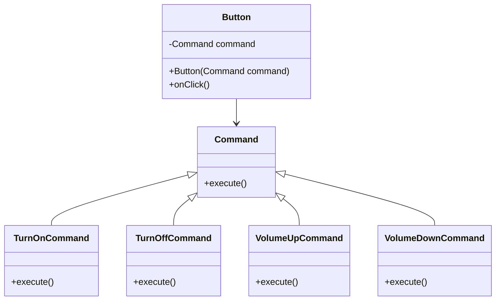

# Command Pattern

## Description

Command is a behavioral design pattern that turns a request into a stand-alone object that contains all information about the request. This transformation lets you parameterize methods with different requests, delay or queue a request's execution, and support undoable operations.

Imagine you are making a Copy Button. You realize that copying needs to be invoked from multiple places like the button, or even hit `ctrl + c` on the keyboard. Originally, having the CopyButton implement the copy logic was fine. But as you add context menus, shortcuts, and other ways to copy, you have to duplicate the copy logic.

The command patterns suggests that GUI objects should not send requests directly. Instead, they should send requests to a command object, which will execute the request. So the GUI just triggers the command, which handles the details.

So instead of all the button subclasses like CopyButton, etc, we can have the Button class store a reference to a command object. When the button is clicked, it calls the command object's execute method. So now, we can just implement different command objects for different actions.

Handlers in [Chain of Responsibility (COR)](/design-patterns/behavioral/chain-of-responsibility.md) can be Commands. Or the request itself can be a command.

You can use Command along with [memento](/design-patterns/behavioral/memento.md) to implement `undo` since memento can save the state just before the command executes.

## Benefits

1. **Open/Closed Principle**: You can introduce new commands into the app without breaking existing client code.
2. **Principle of separation of concerns**: We can decouple GUI from business logic.

## Example

Let's say you have a TV. You can turn it on with a button on the remote or the button on the TV. You can also change the volume with both the remote and the buttons on the TV. 

In this example:

- `Button` is the class that represents the sender of the command.
- `Command` is the command interface.
- `TurnOnCommand`, `TurnOffCommand`, `VolumeUpCommand`, and `VolumeDownCommand` are the concrete command classes.

## Implementation

- `Command` has an `execute()` method.
- `Button` has a `Command` and onClick() method that calls the `execute()` method of the `Command`.

### Diagram



### Code Implementation

=== "Python"
    ```python
    --8<-- "code/design-patterns/behavioral/command/python/command.py"
    ```

=== "Go"
    ```go
    --8<-- "code/design-patterns/behavioral/command/go/command.go"
    ```

### Code Usage

=== "Python"
    ```python
    --8<-- "code/design-patterns/behavioral/command/python/command_usage.py"
    ```

=== "Go"
    ```go
    --8<-- "code/design-patterns/behavioral/command/go/command_usage.go"
    ```