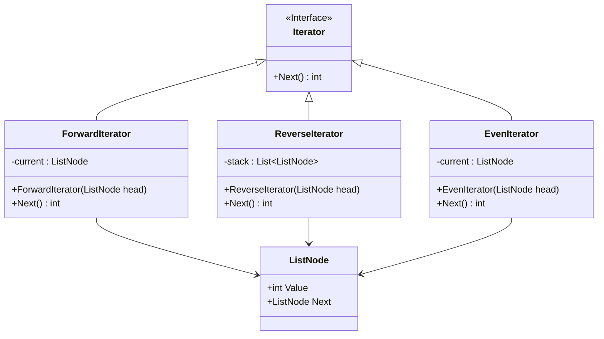

# Iterator Pattern

## Description

Iterator is a behavioral design pattern that lets you traverse elements of a collection without exposing its underlying representation (list, stack, tree, etc.).

You can even have a depth first or breadth first traversal iterator.

You can use Iterators to traverse [Composite](/design-patterns/structural/composite.md) objects.

You can use [Visitor](/design-patterns/behavioral/visitor.md) along with Iterator to traverse a collection and apply an operation to each element.

## Benefits

1. **Open/Closed Principle**: You can implement new types of collections and iterators and pass them to existing code without breaking anything.
2. **Single Responsibility Principle**: You can clean up the client code and the collections by extracting bulky traversal algorithms into separate classes.

## Example

Let's say you have a singly linked list. You can traverse it with a `ForwardIterator` or a `BackwardIterator`.

In this example:

- `LinkedListNode` is the "complex" collection class.
- `Iterator` is the iterator interface.
- `ForwardIterator` and `BackwardIterator` are the concrete iterator classes.

## Implementation

- `Iterator` has a `next()` method that returns the next element.
- `LinkedListNode` has a `value` and `next` properties.

### Diagram



### Code Implementation

=== "Python"
    ```python
    --8<-- "code/design-patterns/behavioral/iterator/python/iterator.py"
    ```

=== "Go"
    ```go
    --8<-- "code/design-patterns/behavioral/iterator/go/iterator.go"
    ```

### Code Usage

=== "Python"
    ```python
    --8<-- "code/design-patterns/behavioral/iterator/python/iterator_usage.py"
    ```

=== "Go"
    ```go
    --8<-- "code/design-patterns/behavioral/iterator/go/iterator_usage.go"
    ```