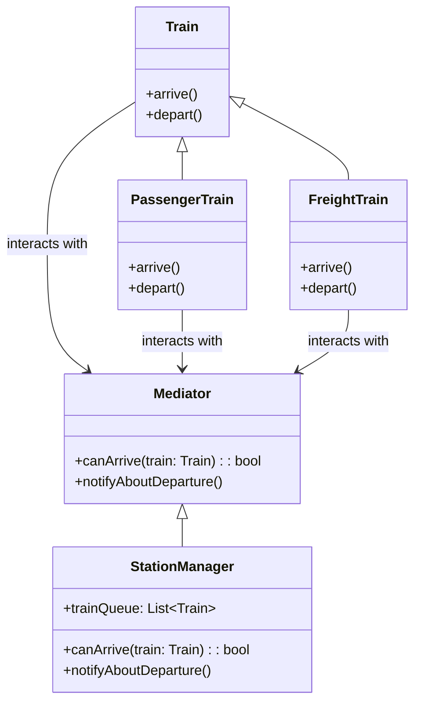

# Mediator Pattern

## Description

Mediator is a behavioral design pattern that prohibits direct communication between objects and instead forces them to collaborate only via a mediator object.

[Facade](/design-patterns/structural/facade.md) is similar in that it also defines a simplified interface to a subsystem of objects. The subsystem is unaware of the facade, and objects within the subsystem can communicate directly. In contrast, Mediator centralizes communication between components of the system. The components only know about the mediator object and don’t communicate directly.

You can use [Visitor](/design-patterns/behavioral/visitor.md) along with Mediator to traverse a collection and apply an operation to each element.

## Benefits

1. **Open/Closed Principle**: You can introduce new mediators without having to change the actual components.
2. **Single Responsibility Principle**: You can extract the communications between various components into a single place, making it easier to comprehend and maintain.

## Example

Let's say we have a railway station traffic system. Trains never communicate directly with each other. The `stationManager` acts as the mediator 

In this example:

- `Mediator` is the mediator interface.
- `stationManager` is the concrete mediator.
- `Train` is the interface for the concrete classes.
- `passengerTrain` and `freightTrain` are the concrete classes.

## Implementation

- `Train` has `arrive()` and `depart()` methods.
- `stationManager` has a `trainQueue`, `canArrive(train)`, and `notifyAboutDeparture()` methods.

### Diagram



### Code Implementation

=== "Python"
    ```python
    --8<-- "code/design-patterns/behavioral/mediator/python/mediator.py"
    ```

=== "Go"
    ```go
    --8<-- "code/design-patterns/behavioral/mediator/go/mediator.go"
    ```

### Code Usage

=== "Python"
    ```python
    --8<-- "code/design-patterns/behavioral/mediator/python/mediator_usage.py"
    ```

=== "Go"
    ```go
    --8<-- "code/design-patterns/behavioral/mediator/go/mediator_usage.go"
    ```