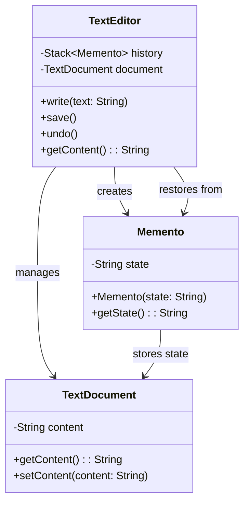

# Memento Pattern

## Description

Memento is a behavioral design pattern that lets you save and restore the previous state of an object without revealing the details of its implementation.

Let's say you're working on a text editor. You want to implement an undo feature that allows users to revert to the previous state of the text. The Memento pattern can help you achieve this. (Even if the objects you save hide fields in private)

The Memento pattern delegates creating the state snapshots to the actual owner of that state, the originator object. Hence, instead of other objects trying to copy the editor’s state from the “outside,” the editor class itself can make the snapshot since it has full access to its own state.

The pattern suggests storing the copy of the object’s state in a special object called memento. The contents of the memento aren’t accessible to any other object except the one that produced it. Other objects must communicate with mementos using a limited interface which may allow fetching the snapshot’s metadata (creation time, the name of the performed operation, etc.), but not the original object’s state contained in the snapshot.

A caretaker is responsible for keeping a list/stack of mementos, and has access to a limited interface of the memento like storing and retrieving but cannot modify or directly access the state. Caretakers can be [Command](/design-patterns/behavioral/command.md) or [Iterator](/design-patterns/behavioral/iterator.md).

You can use memento with [Command](/design-patterns/behavioral/command.md) to implement undoable operations. and [Iterator](/design-patterns/behavioral/iterator.md) to traverse the history of the mementos.

Sometimes, [Prototype](/design-patterns/creational/prototype.md) can be a simpler alternative if easy cloning is possible.

## Benefits

1. You can produce snapshots of the object’s state without violating its encapsulation.
2. You can simplify the originator’s code by letting the caretaker maintain the history of the originator’s state.

## Example

Let's say you're working on a text editor. You want to implement an undo feature that allows users to revert to the previous state of the text. The Memento pattern can help you achieve this.

In this example:

- `TextEditor` is the originator, and wants to create snapshots of its state.
- `TextEditor` is also the caretaker, and maintains a list of mementos.
- `TextDocument` is the document that the `TextEditor` wants to save and restore.
- `Memento` encapsulates the state of the `TextDocument` and can only be created and restored by the `TextEditor`.

## Implementation

- `TextEditor` has a `TextDocument` object to manage the content.
- `TextEditor` has a history stack to maintain mementos.
- `TextEditor` has methods `write(text: String)`, `save()`, `undo()`, and `getContent()`.
- `TextDocument` has a `content` property and methods to get and set this content.
- `Memento` encapsulates the state of `TextDocument`.

### Diagram



### Code Implementation

=== "Python"
    ```python
    --8<-- "code/design-patterns/behavioral/memento/python/memento.py"
    ```

=== "Go"
    ```go
    --8<-- "code/design-patterns/behavioral/memento/go/memento.go"
    ```

### Code Usage

=== "Python"
    ```python
    --8<-- "code/design-patterns/behavioral/memento/python/memento_usage.py"
    ```

=== "Go"
    ```go
    --8<-- "code/design-patterns/behavioral/memento/go/memento_usage.go"
    ```