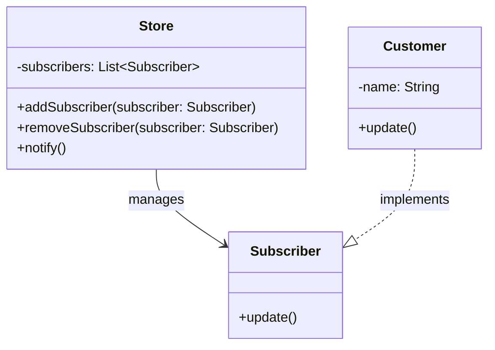

# Observer Pattern

## Description

Observer is a behavioral design pattern that lets you define a subscription mechanism to notify multiple objects about any events that happen to the object they’re observing.

Subscribers (aka observers) can subscribe to a subject, and the Publisher (aka subject) notifies all subscribers when an event occurs.

You can use observer with [Command](/design-patterns/behavioral/command.md) to implement undoable operations. and [Iterator](/design-patterns/behavioral/iterator.md) to traverse the history of the observers.

Sometimes, [Prototype](/design-patterns/creational/prototype.md) can be a simpler alternative if easy cloning is possible.

## Benefits

1. You can produce snapshots of the object’s state without violating its encapsulation.
2. You can simplify the originator’s code by letting the caretaker maintain the history of the originator’s state.

## Example

Let's say a customer visits the store everyday to check a product's availability. That's a waste of time. The store could also send a bunch of emails daily, but that gets very annoying. The Observer pattern can help here:

The product's availability is the `subject`. The store is the `publisher`, and the customer is the `subscriber`. The customer can subscribe to the product's availability and get notified when it's available.

All subscribers should implement the same interface and the publisher communicates with them only via that interface.

In this example:

- `Store` is the publisher that notifies subscribers about product availability.
- `Customer` is the subscriber (observer) that wants to know about product availability.

## Implementation

- `Subscriber` (Observer) is an interface that all subscribers should implement, it has an `update()` method, which is called by the `Store`.
- `Customer` is a concrete subscriber that implements the `Subscriber` interface.
- `Store` (Publisher) has a list of subscribers, a `notify()` method, and methods to add and remove subscribers.
- Usually, the `notify()` method iterates over the list of subscribers and calls their `update()` method.

### Diagram



### Code Implementation

=== "Python"
    ```python
    --8<-- "code/design-patterns/behavioral/observer/python/observer.py"
    ```

=== "Go"
    ```go
    --8<-- "code/design-patterns/behavioral/observer/go/observer.go"
    ```

### Code Usage

=== "Python"
    ```python
    --8<-- "code/design-patterns/behavioral/observer/python/observer_usage.py"
    ```

=== "Go"
    ```go
    --8<-- "code/design-patterns/behavioral/observer/go/observer_usage.go"
    ```