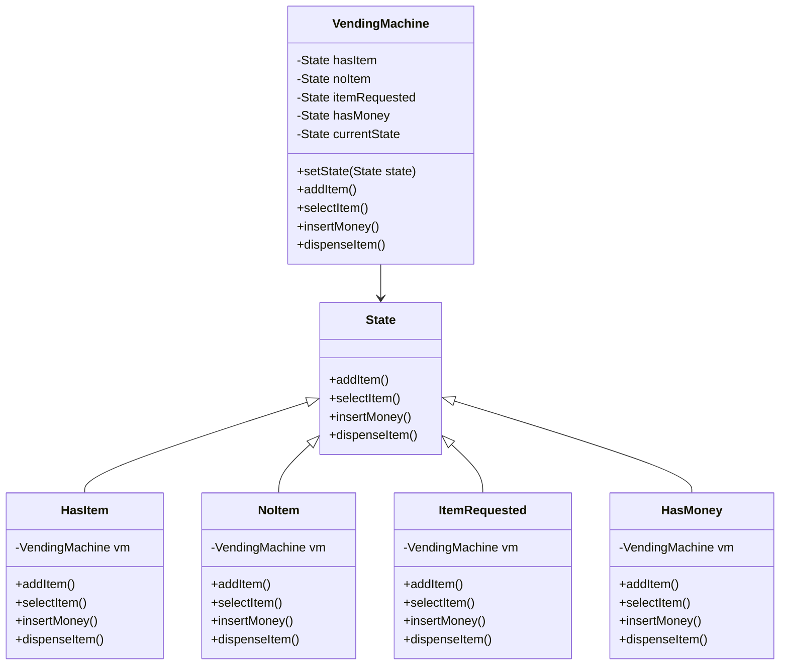
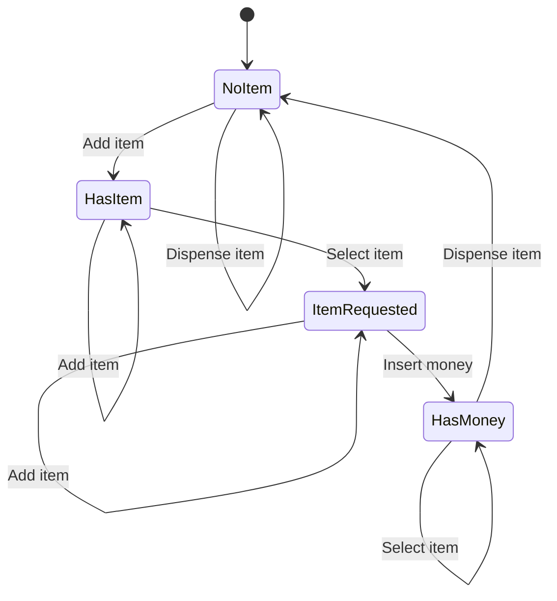

# State Pattern

## Description

State is a behavioral design pattern that lets an object alter its behavior when its internal state changes. It appears as if the object changed its class. (Similar to Finite State Machine)

There are states and predetermined transitions between them. 

State machines are usually implemented with lots of conditional statements (if or switch) that select the appropriate behavior depending on the current state of the object. Usually, this “state” is just a set of values of the object’s fields.

The State pattern suggests that you create new classes for all possible states of an object and extract all state-specific behaviors into these classes.

Instead of implementing all behaviors on its own, the original object, called context, stores a reference to one of the state objects that represents its current state, and delegates all the state-related work to that object.

To transition the context to another state, replace the active state object with another object that represents that new state. (only if all state classes follow the same interface and the context itself works with these objects through that interface).

May look similar to [Strategy](/design-patterns/behavioral/strategy.md) except states may be aware of each other and initiate transitions from one state to another, whereas strategies almost never know about each other.

Similar to [Bridge](/design-patterns/structural/bridge.md), [State](/design-patterns/behavioral/state.md), and [Strategy](/design-patterns/behavioral/strategy.md), and to some degree [adapter](/design-patterns/structural/adapter.md), all these patterns use composition to delegate some work to another object.

## Benefits

1. **Single Responsibility Principle**: Organize the code related to particular states into separate classes.
2. Simplify the code of the context by eliminating bulky state machine conditionals.

## Example

Let's say you have a vending machine with one type of product, and 4 states:

- `hasItem` - when the machine has the product.
- `noItem` - when the machine is out of the product.
- `itemRequested` - when the user requests the product.
- `hasMoney` - when the machine has money.

and 4 actions:

- `Add the item`
- `Select the item`
- `Insert money`
- `Dispense item`

Let’s say vending machine is in itemRequested. Once the “Insert Money” occurs, the machine moves to `hasMoney`.


In this example:

- `VendingMachine` is the context that delegates state-specific behaviors to different state objects.
- `State` is the interface that all concrete states should implement.
- `HasItem`, `NoItem`, `ItemRequested`, and `HasMoney` are concrete states that implement the `State` interface.
- `addItem()`, `insertMoney()`, `selectItem()`, and `dispenseItem()` are actions that the `VendingMachine` can perform.

## Implementation

- `VendingMachine` has a `currentState` property that stores a reference to the current state object.
- For ease of access, `VendingMachine` also has methods to perform actions like `addItem()`, `insertMoney()`, `selectItem()`, and `dispenseItem()`, which just calls the same method on the current state object.
- `VendorMachine` also has a `setState()` method to change the current state.
- `State` is an interface that defines a method for **each action**.
- Each concrete state also has a reference to the `VendingMachine` object to change the state of the machine.

The code of the vending machine is not polluted with this logics, all the state-dependent code lives in respective state implementations

### Diagram



#### State Diagram Of Example



### Code Implementation

=== "Python"
    ```python
    --8<-- "code/design-patterns/behavioral/state/python/state.py"
    ```

=== "Go"
    ```go
    --8<-- "code/design-patterns/behavioral/state/go/state.go"
    ```

### Code Usage

=== "Python"
    ```python
    --8<-- "code/design-patterns/behavioral/state/python/state_usage.py"
    ```

=== "Go"
    ```go
    --8<-- "code/design-patterns/behavioral/state/go/state_usage.go"
    ```