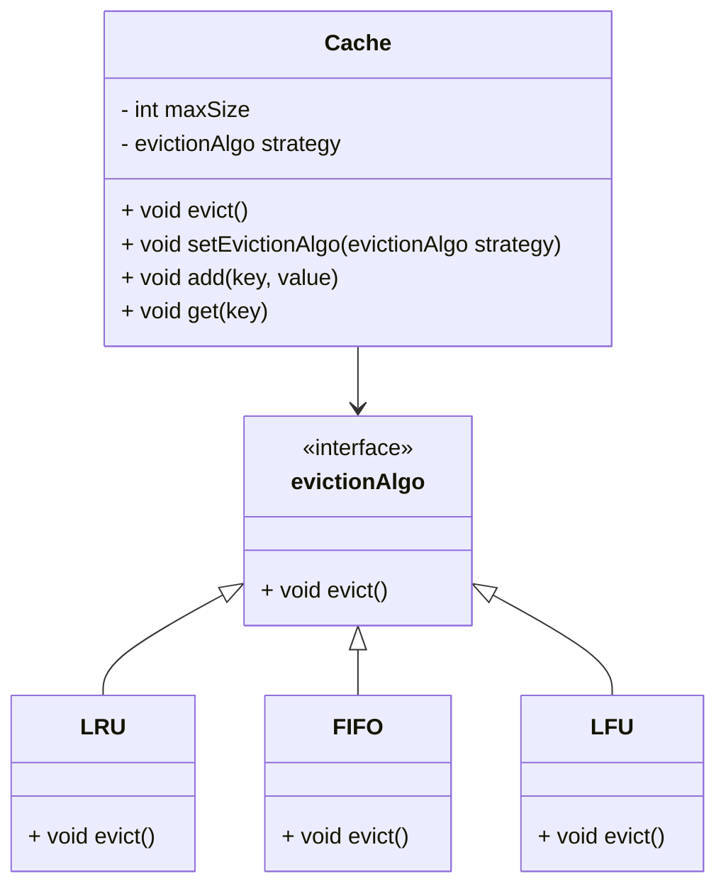

# Strategy Pattern

## Description

Strategy is a behavioral design pattern that lets you define a family of algorithms, put each of them into a separate class, and make their objects interchangeable.

Instead of adding more logic in your main class (which caused merge conflicts in your team), we can extract all of these algorithms into separate classes called strategies.

The original class, called context, must have a field for storing a reference to one of the strategies. The context delegates the work to a linked strategy object instead of executing it on its own.

The context isn’t responsible for selecting an appropriate algorithm for the job. Instead, the client passes the desired strategy to the context. (context doesn’t know much about strategies) stragegies expose a single method for triggering the algorithm encapsulated within the selected strategy.

[Command](/design-patterns/behavioral/command.md) might seem similar but it converts differnet operations into objects while strategy describes different ways to do the same thing.

[Decorator](/design-patterns/structural/decorator.md) lets you change the skin of an object, while Strategy lets you change the guts.

## Benefits

1. You can isolate the implementation details of an algorithm from the code that uses it.
2. You can swap algorithms used inside an object at runtime.

## Example

Let's say you are creating an in-memory-cache. Whenever it reaches its maximum size, some entries have to be evicted to free-up space. You want to implement different strategies for cache eviction. You can have different strategies like:

- Least Recently Used (LRU): remove an entry that has been used least recently.
- First In, First Out (FIFO): remove an entry that was created first.
- Least Frequently Used (LFU): remove an entry that was least frequently used.

In this example:

- `evictionAlgo` is the common interface for all eviction strategies.
- The main `Cache` class has a reference to the `evictionAlgo` interface.

## Implementation

- `LRU`, `FIFO`, and `LFU` are concrete strategies that implement the `evictionAlgo` interface.
- `evict()` is the method that the `Cache` class calls to evict entries.
- `setEvictionAlgo(strategy)` is the method that the `Cache` class uses to change the eviction strategy.
- `Cache` class has a reference to the current strategy object.

### Diagram



#### Strategy Diagram Of Example

```mermaid
strategyDiagram-v2
    [*] --> NoItem
    NoItem --> HasItem : Add item
    HasItem --> ItemRequested : Select item
    ItemRequested --> HasMoney : Insert money
    HasMoney --> NoItem : Dispense item
    HasItem --> HasItem : Add item
    ItemRequested --> ItemRequested : Select item
    ItemRequested --> ItemRequested : Add item
    HasMoney --> HasMoney : Insert money
    HasMoney --> HasMoney : Select item
    NoItem --> NoItem : Select item
    NoItem --> NoItem : Insert money
    NoItem --> NoItem : Dispense item
```

### Code Implementation

=== "Python"
    ```python
    --8<-- "code/design-patterns/behavioral/strategy/python/strategy.py"
    ```

=== "Go"
    ```go
    --8<-- "code/design-patterns/behavioral/strategy/go/strategy.go"
    ```

### Code Usage

=== "Python"
    ```python
    --8<-- "code/design-patterns/behavioral/strategy/python/strategy_usage.py"
    ```

=== "Go"
    ```go
    --8<-- "code/design-patterns/behavioral/strategy/go/strategy_usage.go"
    ```