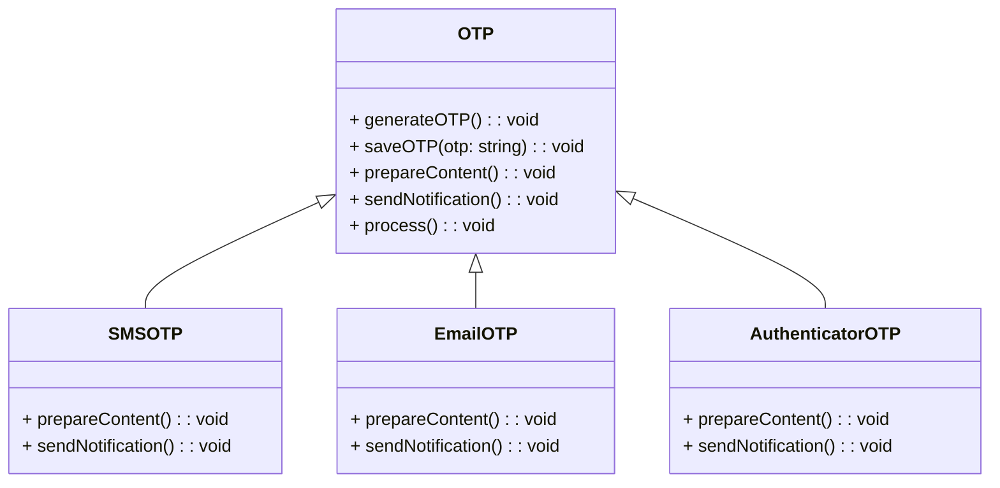

# Template Method Pattern

## Description

Template Method is a behavioral design pattern that defines the skeleton of an algorithm in the superclass but lets subclasses override specific steps of the algorithm without changing its structure.

[Template Method](/design-patterns/behavioral/template-method.md) is based on inheritance: it lets you alter parts of an algorithm by extending those parts in subclasses. While [Strategy](/design-patterns/behavioral/strategy.md) is based on composition: you can alter parts of the object's behavior by supplying it with different strategies that correspond to that behavior.

## Benefits

1. You can pull the duplicate code into a superclass.
2. You can let clients override only certain parts of a large algorithm, making them less affected by changes that happen to other parts of the algorithm.

## Example

Let's say you are creating One Time Password (OTP) functionality. There can be SMS, Email, and Authenticator apps that can generate OTPs.  But irrespective of which one, the entire OTP process is the same:

1. Generate a random n digit number.
2. Save this number in the cache for later verification.
3. Prepare the content.
4. Send the notification.

In this example:

- `OTP` is the abstract class that defines the template method.
- `SMSOTP`, `EmailOTP`, and `AuthenticatorOTP` are concrete classes that implement the `OTP` class.

## Implementation

- `OTP` has a `generateOTP()`, `saveOTP()`, `prepareContent()`, and `sendNotification()` methods.
- `SMSOTP`, `EmailOTP`, and `AuthenticatorOTP` override the `prepareContent()` and `sendNotification()` methods.

### Diagram



#### Template Method Diagram Of Example

```mermaid
template methodDiagram-v2
    [*] --> NoItem
    NoItem --> HasItem : Add item
    HasItem --> ItemRequested : Select item
    ItemRequested --> HasMoney : Insert money
    HasMoney --> NoItem : Dispense item
    HasItem --> HasItem : Add item
    ItemRequested --> ItemRequested : Select item
    ItemRequested --> ItemRequested : Add item
    HasMoney --> HasMoney : Insert money
    HasMoney --> HasMoney : Select item
    NoItem --> NoItem : Select item
    NoItem --> NoItem : Insert money
    NoItem --> NoItem : Dispense item
```

### Code Implementation

=== "Python"
    ```python
    --8<-- "code/design-patterns/behavioral/template-method/python/template_method.py"
    ```

=== "Go"
    ```go
    --8<-- "code/design-patterns/behavioral/template-method/go/template_method.go"
    ```

### Code Usage

=== "Python"
    ```python
    --8<-- "code/design-patterns/behavioral/template-method/python/template_method_usage.py"
    ```

=== "Go"
    ```go
    --8<-- "code/design-patterns/behavioral/template-method/go/template_method_usage.go"
    ```