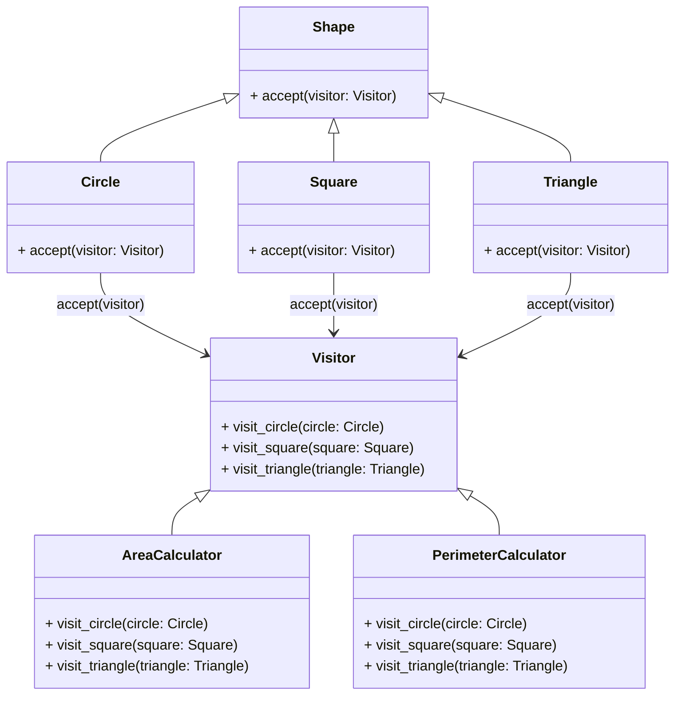

# Visitor Pattern

## Description

Visitor is a behavioral design pattern that lets you separate algorithms from the objects on which they operate.

This pattern is especially useful when dealing with complex object structures, such as composite objects, where you want to perform different operations based on the type of each element.

1. Elements accept Visitors: each element in the object structure has an `accept(visitor)` method that accepts a visitor object. It then calls the visitor's appropriate `visit(element)` method pass, passing itself as an argument.
2. Visitor visits Elements: Visitors implement `visit(element)` methods for each type of element in the object structure. 
3. Double dispatch: The operation that gets executed depends on both the type of the visitor and the type of the element it visits.

You can treat Visitor as a powerful version of the [Command](/design-patterns/behavioral/command.md) pattern. Its objects can execute operations over various objects of different classes. 

You can use Visitor along with [Iterator](/design-patterns/behavioral/iterator.md) to traverse a complex data structure and execute some operation over its elements, even if they all have different classes.

## Benefits

1. **Open/Closed Principle**: You can introduce a new behavior that can work with objects of different classes without changing these classes.
2.  A visitor object can accumulate some useful information while working with various objects. This might be handy when you want to traverse some complex object structure, such as an object tree, and apply the visitor to each object of this structure.

## Example

Imagine you have geometric shapes: circles, squares, and triangles. You want to perform several operations on these shapes, such as calculating area, calculating perimeter, and rendering them on the screen.

Instead of embedding these operations within the shape classes, you could define these operations in separate visitor classes.

In this example:

- `Shape` is the interface and `Circle`, `Square`, and `Triangle` are its concrete classes.
- `Visitor` is the interface that defines the `visit_circle(circle)`, `visit_square(square)`, and `visit_triangle(triange)` methods. (some languages might not support method overloading)
- `AreaCalculator` and `PerimeterCalculator` are concrete visitor classes that implement the `Visitor` interface.

## Implementation

So despite the promise of not modifying the shape classes, we **still** need to modify them to accept visitors. (By adding an `accept(visitor)` method)

- `Shape` has an `accept(visitor)` method.
- `Circle`, `Square`, and `Triangle` implement the `accept(visitor)` method. (which calls the appropriate `visit` method of the visitor)
- Visitor interface has non-implemented `visit_circle(circle)`, `visit_square(square)`, and `visit_triangle(triangle)` methods.

### Diagram



### Code Implementation

=== "Python"
    ```python
    --8<-- "code/design-patterns/behavioral/visitor/python/visitor.py"
    ```

=== "Go"
    ```go
    --8<-- "code/design-patterns/behavioral/visitor/go/visitor.go"
    ```

### Code Usage

=== "Python"
    ```python
    --8<-- "code/design-patterns/behavioral/visitor/python/visitor_usage.py"
    ```

=== "Go"
    ```go
    --8<-- "code/design-patterns/behavioral/visitor/go/visitor_usage.go"
    ```