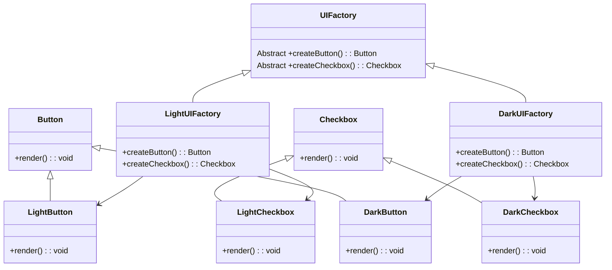

# Abstract Factory Pattern

## Description

The abstract factory pattern is for creating families of related objects - (abstract classes). The key difference is that the Factory Method pattern is used to create one type of product, while the Abstract Factory pattern is used to create families of related products. The Abstract Factory pattern uses multiple factory methods to create different products.

## Benefits

1. **Encapsulation of Object Creation**: The Abstract Factory pattern encapsulates the creation of related objects in one central place, making the code more modular and easier to manage.

## Example

Imagine you are developing a user interface toolkit that needs to support multiple themes such as Light and Dark themes. Each theme includes several components like buttons and checkboxes that need to look and behave consistently. By using the Abstract Factory pattern, you can create a family of components for each theme.

In this example:

- The `UIFactory` is the Abstract Factory.
- The `LightUIFactory` and `DarkUIFactory` are concrete factories that produce components specific to their themes.
- Each factory creates a family of products, such as Button and Checkbox, ensuring that all components in a theme are consistent.

note: The [factory method example](/design-patterns/creational/factory-method#example) focuses on creating a single type of product (Notification Factory) based on some criteria. - while here in UI Facory, you jave `createButton` and `createCheckbox`. Then you can have Light and Dark UI factory as concrete - while in factory method you have `createEmail` and `createSMS`...

## Implementation

- All UI components implement a common interface, for example, `Button` and `Checkbox`.
- The UIFactory is an abstract class with methods like `createButton()` and `createCheckbox()`.
- Concrete factories like LightUIFactory and DarkUIFactory implement these methods to create theme-specific components.

### Diagram

<!-- 2. A mermaid diagram -->


### Code Implementation

=== "Python"
    ```python
    --8<-- "code/design-patterns/creational/abstract-factory/python/abstract_factory.py"
    ```

=== "Go"
    ```go
    --8<-- "code/design-patterns/creational/abstract-factory/go/abstract_factory.go"
    ```

### Code Usage

=== "Python"
    ```python
    --8<-- "code/design-patterns/creational/abstract-factory/python/abstract_factory_usage.py"
    ```

=== "Go"
    ```go
    --8<-- "code/design-patterns/creational/abstract-factory/go/abstract_factory_test.go"
    ```