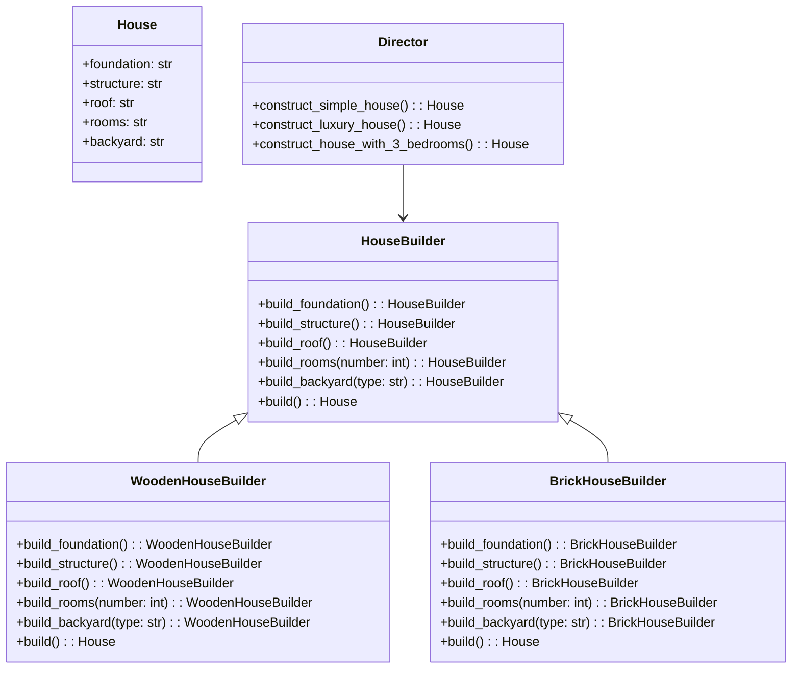

# Builder Pattern

## Description

Builder is a creational design pattern that lets you construct complex objects step by step. The pattern allows you to produce different types and representations of an object using the same construction code.

Let's say you are building a house - all houses need 4 walls, floor, roof and door. But some houses want a backyard, heating, etc. You don't want to create a **million subclasses** and you also don't want a **big constructor** (with a bunch of null calls). 

Note: Having a director class is also optional, but it can help with organizing construction routines. 

## Benefits

1. **Controlled Construction Process**: The Builder pattern allows you to construct objects step by step, providing more control over the construction process and making it easier to create complex objects.

## Example

Let's say you want to build all types of houses. 

In this example:

- The `House` is the complex object we want to create.
- We want to build a wooden house or brick house - each requires a different setup for the foundation. (due to material)
- We might also want a luxury or basic house. The `Director` can take care of this.

## Implementation

- The complex object `House` has a default constructor initializing all its fields to `None`. The fields will include all types of possible houses. 
- The `HouseBuilder` is our basic builder interface.
- `WoodenHouseBuilder` and `BrickHouseBuilder` are our concrete house builders.
- The `Director` can `construct_simple_house()` or `construct_luxury_house()` or `construct_house_with_3_bedrooms()`, etc. 
- `build_backyard(type)` can take a type too to mix and match!
- The steps methods return the builder so we allow for chanining calls. 

### Diagram

<!-- 2. A mermaid diagram -->


### Code Implementation

=== "Python"
    ```python
    --8<-- "code/design-patterns/creational/builder/python/builder.py"
    ```

=== "Go"
    ```go
    --8<-- "code/design-patterns/creational/builder/go/builder.go"
    ```

### Code Usage

=== "Python"
    ```python
    --8<-- "code/design-patterns/creational/builder/python/builder_usage.py"
    ```

=== "Go"
    ```go
    --8<-- "code/design-patterns/creational/builder/go/builder_test.go"
    ```