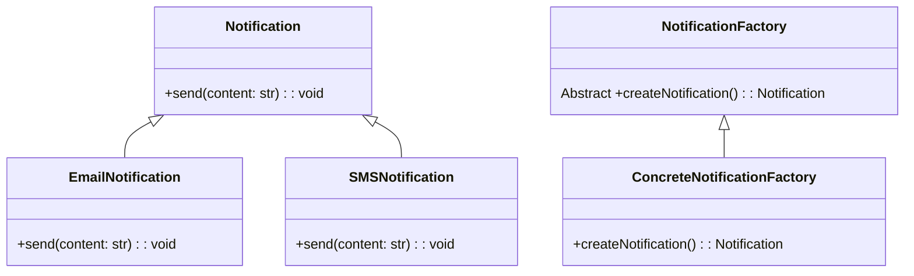

# Factory Method Pattern

## Description

The Factory Method pattern suggests that you replace direct object construction calls (using the new operator) with calls to a special factory method. Don’t worry: the objects are still created via the new operator, but it’s being called from within the factory method. Objects returned by a factory method are often referred to as products.

## Benefits

1. **Decoupling Object Creation**: The Factory Method Pattern separates the process of creating an object from the rest of the code, making the codebase more modular and easier to manage.

2. **Single Responsibility Principle**: By centralizing the object creation code in one place, the Factory Method Pattern adheres to the Single Responsibility Principle, as the classes do not need to know the details of object creation.

3. **Flexibility and Extensibility**: This pattern provides flexibility by allowing the creation of objects without specifying the exact class of the object that will be created. It also makes the code more extensible by allowing new classes to be added without modifying existing code.

4. **Enhanced Maintainability**: By using the Factory Method Pattern, changes in the object creation process affect only the factory code, making the system easier to maintain and update.

5. **Code Reusability**: The Factory Method Pattern promotes code reuse by enabling the creation of objects through a common interface, which can be used across different parts of the application.


## Example

Imagine you are building a notification system that needs to send notifications through different channels such as email, SMS, and push notifications. The type of notification to be sent depends on user preferences, and you want to encapsulate the notification creation logic in a single place.

In this example:

- The NotificationFactory is the Factory.
- The Factory Method Pattern ensures that the application creates the appropriate type of notification based on user preferences.
- This approach simplifies the notification creation process and makes it easier to add new notification types in the future.


## Implementation

- All notifications have a `send()` method (business logic), so `Notifications` is the base class, `EmailNotifcation` and `SMSNotification` inherit from the base and must implement their custom business logic.
- The `NotificationFactory` is also a base (abstract) class, `ConcreateNotificationFactory` which can be `SMSNotificationFactory` or `EmailNotificationFactory` will implement `createNotification() -> Notification` separately.
- So in runtime, depending on which product you want to create, you'd instantiate that factory and create it.

### Diagram

<!-- 2. A mermaid diagram -->


### Code Implementation

=== "Python"
    ```python
    --8<-- "code/design-patterns/creational/factory-method/python/factory_method.py"
    ```

=== "Go"
    ```go
    --8<-- "code/design-patterns/creational/factory-method/go/implementation/factory_method.go"
    ```

### Code Usage

=== "Python"
    ```python
    --8<-- "code/design-patterns/creational/factory-method/python/factory_method_usage.py"
    ```

=== "Go"
    ```go
    --8<-- "code/design-patterns/creational/factory-method/go/implementation/factory_method_test.go"
    ```