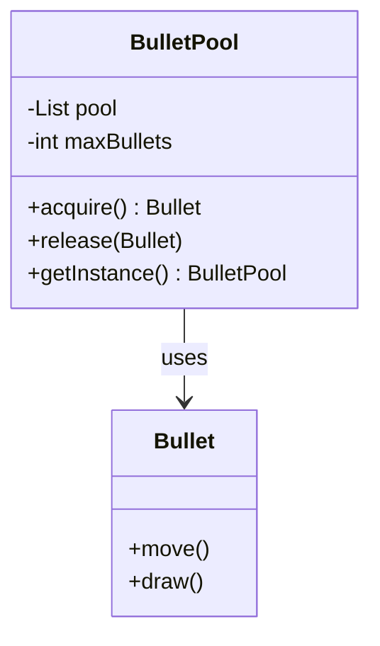

# Object Pool Pattern

## Description

The Object Pool offers a mechanism to reuse objects from a set of initialized objects—called the "pool"—instead of allocating and destroying them on demand. For objects that get created and destroyed fast - this pattern optimizes performance. 

## Benefits

1. **Improves Performance**: Reduces instantiation cost by recycling objects.
2. **Manages Memory Usage**: Helps manage the memory footprint by limiting the creation of new objects.

## Example

Consider a scenario in a gaming application where bullets are frequently created and destroyed. Using the Object Pool pattern, you can have a pool of bullet objects at game start and recycle these objects throughout the game play.

In this example:

- `BulletPool` manages a collection of Bullet objects, it is the `ReusuablePool`.
- `Bullet` is the `Resusable` and are acquired when a gun fires and released when they hit a target or move off-screen.

## Implementation

- The `Reusuable Pool` should ideally be a [Singleton](/design-patterns/creational/singleton). 
    - As such we have a `getInstance` method to get the singleton. 
- `acquire()` acquires a Bullet from the pool.
- `release(bullet: Bullet)` releases the bullet back to the pool.
- `maxBullets` is used to limit the number of bullets. 


### Diagram

<!-- 2. A mermaid diagram -->


### Code Implementation

=== "Python"
    ```python
    --8<-- "code/design-patterns/creational/object-pool/python/object_pool.py"
    ```

=== "Go"
    ```go
    --8<-- "code/design-patterns/creational/object-pool/go/object_pool.go"
    ```

### Code Usage

=== "Python"
    ```python
    --8<-- "code/design-patterns/creational/object-pool/python/object_pool_usage.py"
    ```

=== "Go"
    ```go
    --8<-- "code/design-patterns/creational/object-pool/go/object_pool_test.go"
    ```