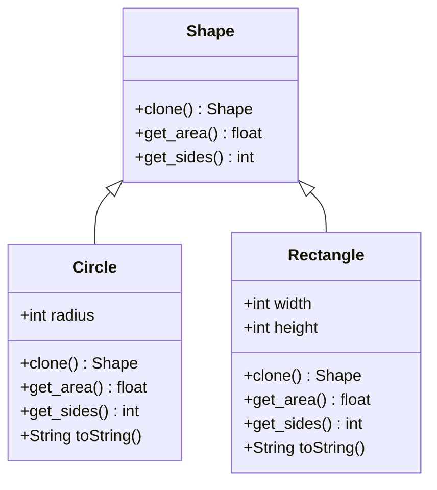

# Prototype Pattern

## Description

Prototype is a creational design pattern that lets you copy existing objects without making your code dependent on their classes. Normally, to copy an object, you'd have to create that object and then copy its fields over. But some of those fields may be private, or the class itself may be an interface.

The pattern declares a common interface for all objects that support cloning. This interface lets you clone an object without coupling your code to the class of that object. Usually, such an interface contains just a single `clone` method.

`clone`: creates an object of the current class and carries over all of the field values of the old object into the new one. You can even copy private fields because most programming languages let objects access private fields of other objects that belong to the same class.

## Benefits

1. **Simplifies object creation**: The pattern simplifies the creation of complex objects by cloning a prototype, reducing the complexity associated with creating new instances from scratch.

## Example

Let's consider a scenario where you have a shape interface with concrete implementations for different types of shapes. You can create clones of these shapes without depending on their specific classes.

In this example:

- The `Shape` is the prototype interface. 
- `Circle` and `Rectangle` are the concrete prototypes. 

## Implementation

- The `Shape` interface has `clone()`, `get_area()`, and `get_sides()`
- `Circle`'s constructor needs only a radius while `Rectangle` needs width and height
- Each shape implements clone differently - but call the constructor, passing in its own fields.

### Diagram

<!-- 2. A mermaid diagram -->


### Code Implementation

=== "Python"
    ```python
    --8<-- "code/design-patterns/creational/prototype/python/prototype.py"
    ```

=== "Go"
    ```go
    --8<-- "code/design-patterns/creational/prototype/go/prototype.go"
    ```

### Code Usage

=== "Python"
    ```python
    --8<-- "code/design-patterns/creational/prototype/python/prototype_usage.py"
    ```

=== "Go"
    ```go
    --8<-- "code/design-patterns/creational/prototype/go/prototype_test.go"
    ```