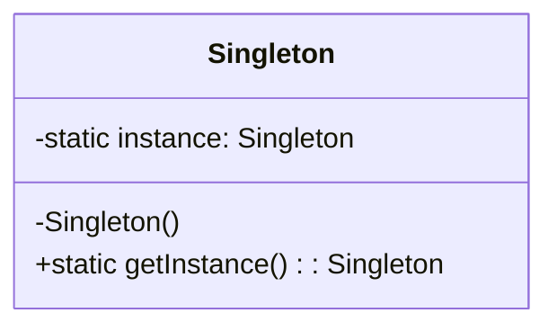

# Singleton Pattern

## Description

The Singleton Pattern ensures a class has only one instance and provides a global point of access to it. This pattern is useful when exactly one object is needed to coordinate actions across the system.

## Benefits

1. **Controlled Access to a Single Instance**: The Singleton Pattern ensures that there is precisely one instance of a class, which is particularly useful when managing shared resources like configuration settings or logging.

2. **Reduced Namespace Pollution**: By providing a single point of access, the Singleton Pattern avoids the proliferation of global variables and reduces the risk of naming conflicts.

3. **Lazy Initialization**: Singleton can be initialized only when it's needed, rather than when the application starts. This can lead to better resource management.

4. **Global Access Point**: Singleton provides a global access point to an instance, making it easy to use and access the singleton instance throughout the application.

5. **Consistency**: Ensures that all components of an application use the same instance, leading to consistent behavior and state across the application.

6. **Resource Management**: Useful for managing limited resources, such as database connections or thread pools, by ensuring that only one instance is used to manage these resources.


## Example

Imagine you are building a web application that needs to interact with a database. Creating a new database connection every time a request is made would be inefficient and resource-intensive. Instead, you can use the Singleton Pattern to ensure that only one database connection is created and shared across the entire application.

In this example:

- The database connection is the **Singleton**.
- The Singleton Pattern ensures that the application creates only one database connection and uses it for all database operations.
- This approach improves performance by reducing the overhead of establishing multiple connections and ensures consistent access to the database.


## Implementation

- The Singleton Class's contructor is normal - does everything a normal contructor would do, except it is `private`!
- `getInstance()` static method that returns the instance
    - if no instance, (acquire thread lock if parallel), call private constructor
    - otherwise return instance

### Diagram

<!-- 2. A mermaid diagram -->


### Code Implementation

=== "Python"
    ```python
    --8<-- "code/design-patterns/creational/singleton/python/singleton_implementation.py"
    ```

=== "Go"
    ```go
    --8<-- "code/design-patterns/creational/singleton/go/implementation/singleton_implementation.go"
    ```

### Code Usage

=== "Python"
    ```python
    --8<-- "code/design-patterns/creational/singleton/python/singleton_usage.py"
    ```

=== "Go"
    ```go
    --8<-- "code/design-patterns/creational/singleton/go/usage/singleton_usage_test.go"
    ```