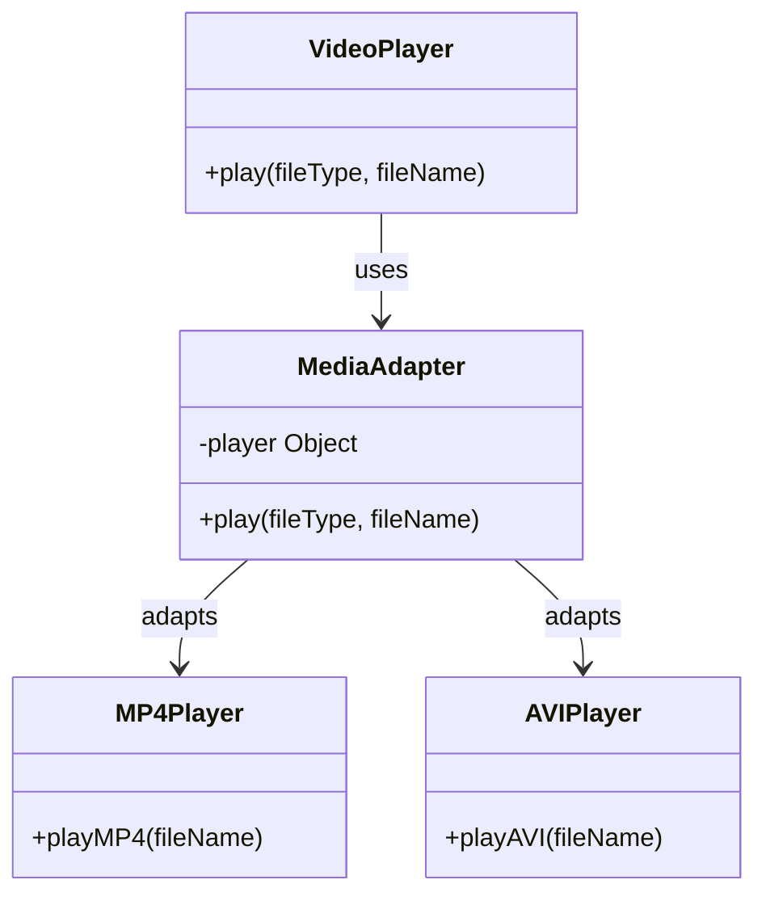

# Adapter Pattern

## Description

The Adapter pattern is a structural design pattern that allows objects with **incompatible objects to work collaborate**. It acts as a bridge between two otherwise incompatible interfaces by wrapping itself around an object and presenting a different interface. This is particularly useful when integrating new components into existing systems where interfaces do not match.


## Benefits

1. **Increased Compatibility**: Allows two different interfaces to work together without modifying their source code.
2. **Reusability**: Enables the reuse of existing classes even if their interfaces do not match the required business environment.

## Example

Imagine you have developed a video player application that initially supports only MP4 files. Over time, you want to expand its capabilities to support additional formats like AVI and MKV without modifying the existing media player code.

In this example:

- `MP4Player` represents the original system designed to play MP4 files.
- `MediaAdapter` adapts other types of media interfaces (like AVI and MKV players) to the interface expected by the existing video player application.

## Implementation

Inheritance is not strictly necessary, but it is commonly used to achieve interface compatibility, especially in languages that support it. The pattern can be implemented in two main ways: the class adapter approach using inheritance, and the object adapter approach using composition.
Here - we do not use inheritance.

- `VideoPlayer` is the `Target` and the main class that uses the `MediaAdapter` to play different types of media files.
    - The `Target` defines the domain-specific interface that the client uses. This is the interface that the adapter must adapt the adaptee to match. 
- The `AVIPlayer` class is an `Adaptee` and a new system that plays AVI files. (new system) (Adaptee)
- The `MP4Player` class is an `Adaptee` and is the original system that plays MP4 files. (legacy system)
- The `MediaAdapter` implements the same interface as the `MP4Player` but uses different media player implementations to handle various formats. As you can see, this class makes it possible for the `VideoPlayer` to play different types of media files by providing the necessary conversion. The adapter's `play` method is responsible for determining the type of media file and delegating the request to the appropriate adaptee.

### Diagram

<!-- 2. A mermaid diagram -->


### Code Implementation

=== "Python"
    ```python
    --8<-- "code/design-patterns/structural/adapter/python/adapter.py"
    ```

=== "Go"
    ```go
    --8<-- "code/design-patterns/structural/adapter/go/adapter.go"
    ```

### Code Usage

=== "Python"
    ```python
    --8<-- "code/design-patterns/structural/adapter/python/adapter_usage.py"
    ```

=== "Go"
    ```go
    --8<-- "code/design-patterns/structural/adapter/go/adapter_test.go"
    ```