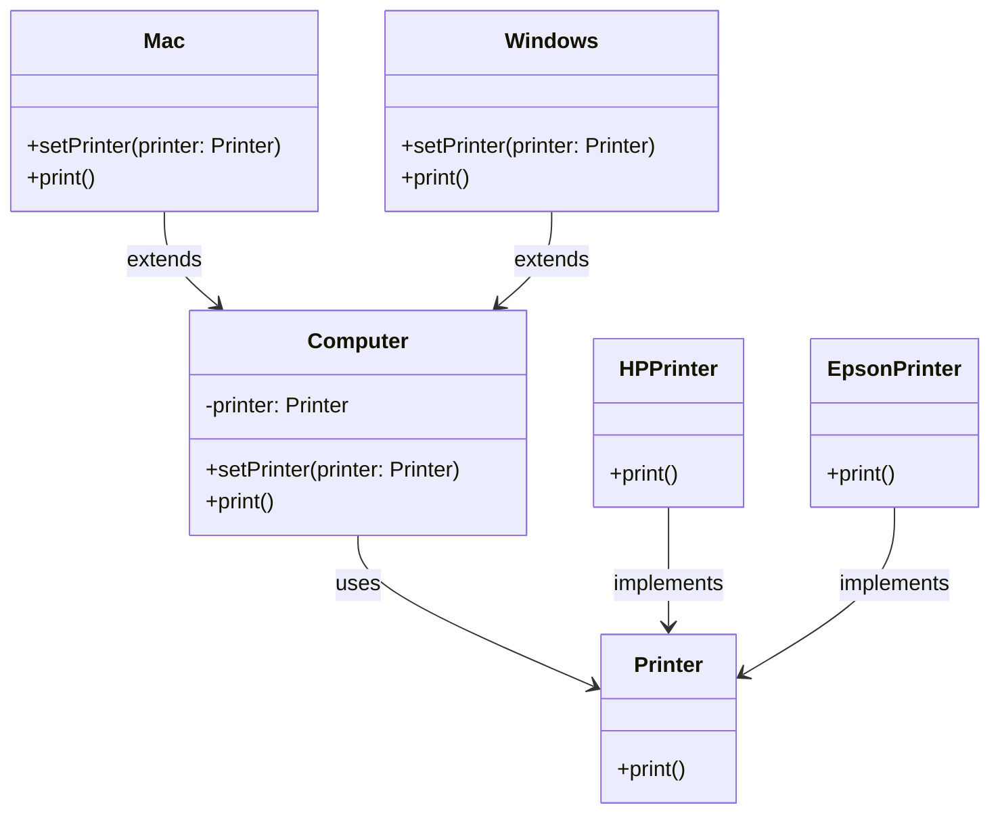

# Bridge Pattern

## Description

Bridge is a structural design pattern that lets you split a large class or a set of closely related classes into two separate hierarchies—**abstraction and implementation**—which can be developed independently of each other.

**abstraction** - The high level control layer for some entity. This does not do work and simply delegates to the `implementation` layer. (example: abstraction is UI and implementation is Backend)

Bridge is usually designed up-front, letting you develop parts of an application independently of each other. On the other hand, [Adapter](/design-patterns/structural/adapter.md) is commonly used with an existing app/legacy code to make some otherwise-incompatible classes work together nicely.


## Benefits

1. **Decoupling**: Separates the abstraction from the implementation, allowing them to be developed independently.
2. **Flexibility**: Enables the implementation of the abstraction to change dynamically at runtime.
3. **Scalability**: Facilitates the addition of new abstractions and implementations without altering existing code.

## Example

Say, you have two types of computers: Mac and Windows. Also, two types of printers: Epson and HP. Both computers and printers need to work with each other in any combination. The client doesn’t want to worry about the details of connecting printers to computers.

If we introduce new printers, we don’t want our code to grow exponentially. Instead of creating four structs for the 2*2 combination, we create two hierarchies:

In this example:

- `Abstraction`: the computers.
- `Implementation`: the printers.


## Implementation

- The `Abstraction` (Conputer) contains a reference to the `Implementor` (Printer) and delegates all work to it.
- The `Implementor` (Device) is an interface that defines the operations that the `ConcreteImplementors` (HPPrinter and EpsonPrinter) must implement.

### Diagram

<!-- 2. A mermaid diagram -->


### Code Implementation

=== "Python"
    ```python
    --8<-- "code/design-patterns/structural/adapter/python/adapter.py"
    ```

=== "Go"
    ```go
    --8<-- "code/design-patterns/structural/adapter/go/adapter.go"
    ```

### Code Usage

=== "Python"
    ```python
    --8<-- "code/design-patterns/structural/adapter/python/adapter_usage.py"
    ```

=== "Go"
    ```go
    --8<-- "code/design-patterns/structural/adapter/go/adapter_test.go"
    ```