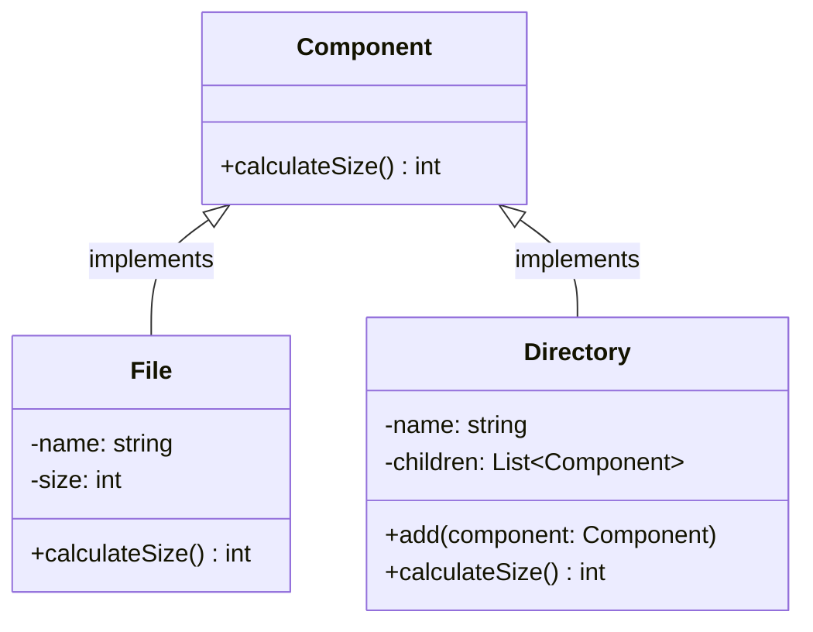

# Composite Pattern

## Description

Composite is a structural design pattern that lets you compose objects into tree structures and then work with these structures as if they were individual objects.

Great pattern for working with tree structures and using recursion over the structure. 


## Benefits

1.  **Simplifies Client Code**: You can work with complex tree structures more conveniently: use polymorphism and recursion to your advantage.
2.  **Flexibility**: The pattern allows you to create complex structures by composing objects into tree structures. This makes it easy to add new types of objects to the structure without changing the client code.

## Example

On your computer your file system can have files and directories. Let's say you want to calculate the size of all objects in a directory. This memory calculation operation applies to both files and folders

In this example:

- `Component`: the interface that defines the operations that can be performed on both files and directories.
- `Leaf`: the class that represents a file.
- `Composite`: the class that represents a directory and can contain both files and other directories.

## Implementation

- The `Component` interface has a `calculateSize` method that calculates the size of the object.
- The `Directory` class is a `Composite` that can contain both files and directories. It implements the `Component` interface and delegates the `calculateSize` operation to its children.
- The `File` class is a `Leaf` that represents a file. It also implements the `Component` interface and provides the implementation for the `calculateSize` method.

### Diagram

<!-- 2. A mermaid diagram -->


### Code Implementation

=== "Python"
    ```python
    --8<-- "code/design-patterns/structural/composite/python/composite.py"
    ```

=== "Go"
    ```go
    --8<-- "code/design-patterns/structural/composite/go/composite.go"
    ```

### Code Usage

=== "Python"
    ```python
    --8<-- "code/design-patterns/structural/composite/python/composite_usage.py"
    ```

=== "Go"
    ```go
    --8<-- "code/design-patterns/structural/composite/go/composite_test.go"
    ```