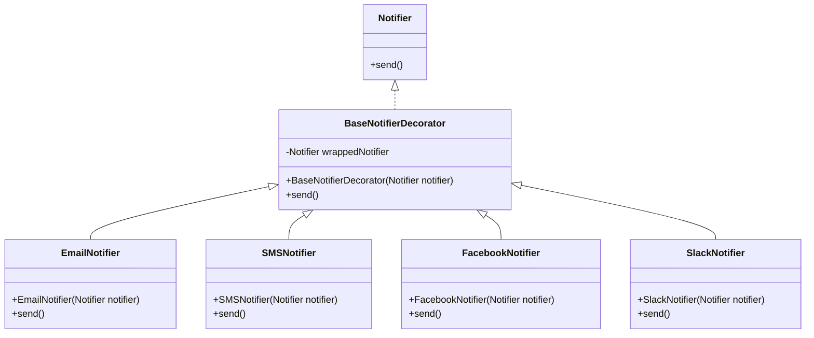

# Decorator Pattern

## Description

Decorator - also known as “Wrapper” - is a structural design pattern that lets you attach new behaviors to objects by placing these objects inside special wrapper objects that contain the behaviors.

Decorator extends an existing interface and allows for recursive composition (multiple decorators) while [Adapter](/design-patterns/structural/adapter.md) provides a completely different interface for accessing an existing object. 

## Benefits

1.  **Extensibility**: You can extend an object’s behavior without making a new subclass. Or combine several behaviors by wrapping an object into multiple decorators.
2.  **Flexibility**: You can add or remove responsibilities from an object at runtime.

## Example

Imagine that you’re working on a notification library which lets other programs notify their users about important events. \

Initially, the library only consisted of the `Notification` class with a `send()` method for emails. Now, we want to add support for SMS, Facebook, and Slack. 

Instead, we can create a set of decorators, each implementing the `Notifier` interface and adding a specific `send()` method.

In this example:

- `Notifier` is the interface that defines the operations that can be performed on a notification.
- `BaseNotifierDecorator` is the abstract class that wraps a `Notifier` object and implements the `Notifier` interface.
- `EmailNotifier`, `SMSNotifier`, `FacebookNotifier`, and `SlackNotifier` are concrete decorators that add specific behaviors to the notification and also implement `send()` method.

## Implementation

- The Wrapper/Decorator (`BaseNotifierDecorator`) should implement the same interface as the wrapped object.
- The concrete decorators (`EmailNotifier`, `SMSNotifier`, `FacebookNotifier`, `SlackNotifier`) should extend the `BaseNotifierDecorator` and add specific behaviors to the notification.
- The constructor of the concrete decorators should accept a `Notifier` - allowing for recursive composition. i.e `decorator1(decorator2(decorator3(object)))`

### Diagram

<!-- 2. A mermaid diagram -->


### Code Implementation

=== "Python"
    ```python
    --8<-- "code/design-patterns/structural/decorator/python/decorator.py"
    ```

=== "Go"
    ```go
    --8<-- "code/design-patterns/structural/decorator/go/decorator.go"
    ```

### Code Usage

=== "Python"
    ```python
    --8<-- "code/design-patterns/structural/decorator/python/decorator_usage.py"
    ```

=== "Go"
    ```go
    --8<-- "code/design-patterns/structural/decorator/go/decorator_usage.go"
    ```