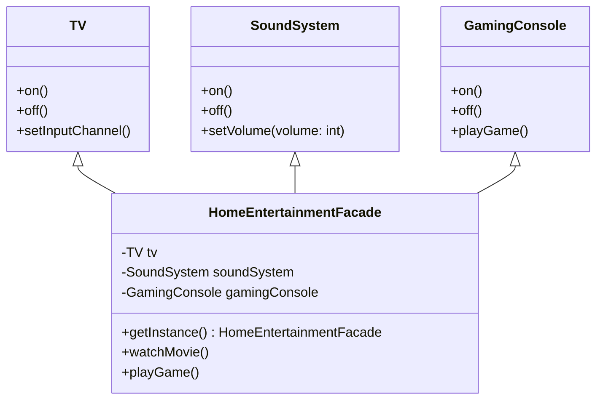

# Facade Pattern

## Description

Facade is a structural design pattern that provides a simplified interface to a library, a framework, or any other complex set of classes.

Having a facade is handy when you need to integrate your app with a sophisticated library that has dozens of features, but you just need a tiny bit of its functionality.

When you call a shop to place a phone order, an operator is your facade to all services and departments of the shop. The operator provides you with a simple voice interface to the ordering system, payment gateways, and various delivery services.

Facade defines a new interface for existing objects, whereas [Adapter](/design-patterns/structural/adapter.md) tries to make the existing interface usable. [Adapter](/design-patterns/structural/adapter.md) usually wraps just one object, while Facade works with an entire subsystem of objects.

Facade defines a simplified interface to a subsystem of objects, but it doesn’t introduce any new functionality. The subsystem itself is unaware of the facade. Objects within the subsystem can communicate directly.

Meanwhile, Mediator centralizes communication between components of the system. The components only know about the mediator object and don’t communicate directly.

A Facade can be a Singleton - often the case since a single facade is usually sufficient.


## Benefits

1. **Isolation**:  You can isolate your code from the complexity of a subsystem.

## Example

Consider a complex library for a home entertainment system. This system includes various components like the TV, sound system, and gaming console, each with its own interface. The Facade pattern can be used to create a single interface to manage these components.

In this example:

- `TV` and `SoundSystem`, and `GamingConsole` are classes that represent the subsystem components.
- `HomeEntertainmentFacade` is the facade that provides a simple interface to the subsystem, and allows you to turn on/off the system, watch a movie, play a game, etc.

## Implementation

Notice the subsystem interactions that the facade provides. The facade should provide a simple interface to a complex subsystem.

- The Facade (`HomeEntertainmentFacade`) should provide a simple interface to a complex subsystem.
  - Playing a movie should always turn on the TV and sound system, and set the input channel.
  - Playing a game should always turn on the gaming console, TV, and sound system.

### Diagram



### Code Implementation

=== "Python"
    ```python
    --8<-- "code/design-patterns/structural/facade/python/facade.py"
    ```

=== "Go"
    ```go
    --8<-- "code/design-patterns/structural/facade/go/facade.go"
    ```

### Code Usage

=== "Python"
    ```python
    --8<-- "code/design-patterns/structural/facade/python/facade_usage.py"
    ```

=== "Go"
    ```go
    --8<-- "code/design-patterns/structural/facade/go/facade_usage.go"
    ```