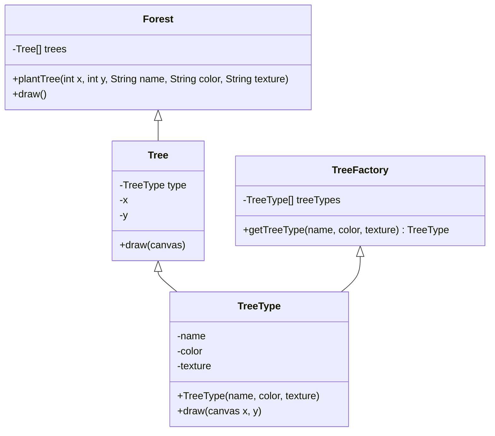

# flyweight Pattern

## Description

flyweight is a structural design pattern that provides lets you fit more objects into the available amount of RAM by sharing common parts of state between multiple objects, instead of keeping all of the data in each object.

Let's say you made a game with particles and when you play it, it keeps crashing. Looks like each particle stores color and sprite are same for this effect, while position, movement vector and speed are unique. 

So the color and sprite are **intrinsic states**. While the position, movement vector and speed are **extrinsic states**.

The intrinsic state is shared among multiple objects, while the extrinsic state can vary and is passed to the flyweight objects as needed. The extrinsic states of objects are moved to a container object. 

Flyweight shows how to make lots of little objects, whereas [Facade](/design-patterns/structural/facade.md) shows how to make a single object that represents an entire subsystem.

Flyweight is like [Singleton](/design-patterns/creational/singleton.md) except Flyweight can have multiple instances with different intrinsic states. Also, Flyweight objects are immutable.

You might be trading RAM over CPU cycles when some of the context data needs to be recalculated each time somebody calls a flyweight method.

## Benefits

1. **Save memory**:  Your app can spawn a huge number of similar objects. 

## Example

Let's say you a rendering millions of tree objects in a game. Each tree has a name, color, texture, position, and size. We move the **name**, **color**, and **texture** to the flyweight class (TreeType). Now, our code can create trees using a flyweight factory. 

In this example:

- `Tree` is the class that represents the tree object. 
- `TreeType` is the flyweight class that stores the intrinsic states of the tree.
-  `TreeFactory` is the flyweight factory that creates and manages the flyweight objects.

## Implementation

- `TreeFactory` has a factory method `getFlyweight(repeatingState)` - `getTreeType(name, color, texture)` that accepts the intrinsic state of the desired flyweight from a client, looks for an existing flyweight object matching this state, and returns it if it was found. If not, it creates a new flyweight and adds it to the pool.
- `TreeFactory` also has a cache: `treeTypes: TreeType[]` that stores the flyweight objects.
- `Forest` is the client which can `plantTree(x, y, name, color, texture)` and `draw()`.
- The key to the pattern is `planTree` which uses the `TreeFactory` to reuse the flyweight objects. So multiple trees can share the same `TreeType` object. Thus, saving memory.

### Diagram



### Code Implementation

=== "Python"
    ```python
    --8<-- "code/design-patterns/structural/flyweight/python/flyweight.py"
    ```

=== "Go"
    ```go
    --8<-- "code/design-patterns/structural/flyweight/go/flyweight.go"
    ```

### Code Usage

=== "Python"
    ```python
    --8<-- "code/design-patterns/structural/flyweight/python/flyweight_usage.py"
    ```

=== "Go"
    ```go
    --8<-- "code/design-patterns/structural/flyweight/go/flyweight_usage.go"
    ```