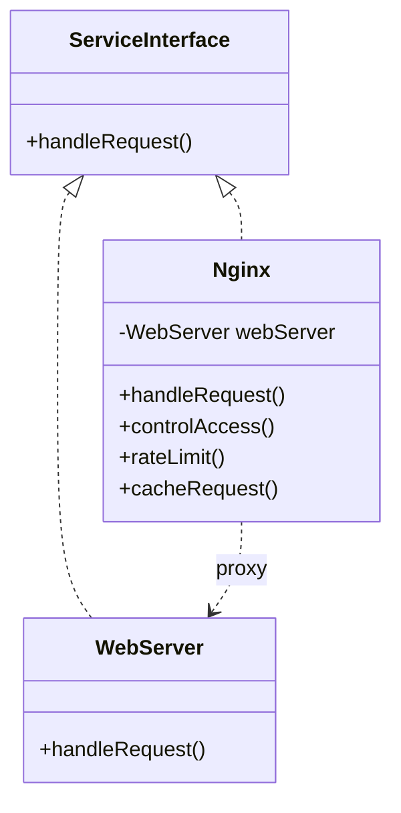

# Proxy Pattern

## Description

Proxy is a structural design pattern that provides a substitute or placeholder for another object, allowing you to perform something before or after the request gets through to the original object.

A credit card is a proxy for a bank account, which is a proxy for cash. They can all be used to pay for something (implement `pay()` interface). So it's great because we don't need to carry cash around. Also, the income is transferred to the shop owner's bank account, which is nice because we don't have to risk getting robbed on the way to the bank.

With [Adapter](/design-patterns/structural/adapter.md) you access an existing object via different interface. With Proxy, the interface stays the same. With [Decorator](/design-patterns/structural/decorator.md) you access the object via an enhanced interface.

Unlike [Facade](/design-patterns/structural/facade.md), Proxy has the same interface as the service object, which makes them interchangeable.

[Decorator](/design-patterns/structural/decorator.md) and Proxy have similar structures, but very different intents. Both patterns are built on the composition principle, where one object is supposed to delegate some of the work to another. The difference is that a Proxy usually manages the life cycle of its service object on its own, whereas the composition of Decorators is always controlled by the client.

## Benefits

1. **Open/Closed Principle** You can introduce new proxies without changing the service or clients.
2. The proxy works even if the service object isn’t ready or is not available.

## Example

You can make a `virtual proxy` for creating expensive objects when they are needed. And checking if clients are inactive to free up resources.

You can make a `protective proxy` to check if the client has the necessary access permissions.

You can make a `cache proxy` to cache the results of the expensive operations.

You can make a `logging proxy` to log requests to the service.

For this example let's make a Nginx proxy server that provides controlled access, rate limiting, and caching for a web server.

In this example:

- `ServiceInterface` is the interface that represents the service.
- `WebServer` is the class that represents the service.
- `Nginx` is the class that represents the proxy.

## Implementation

- `WebServer` and `Nginx` both implement the `ServiceInterface`.
- `Nginx` has a reference to the `WebServer` (service) object.
- `Nginx` has some additional methods like `controlAccess()`, `rateLimit()`, and `cacheRequest()` that are called before or after the `handleRequest()` method of the `WebServer`.

### Diagram



### Code Implementation

=== "Python"
    ```python
    --8<-- "code/design-patterns/structural/proxy/python/proxy.py"
    ```

=== "Go"
    ```go
    --8<-- "code/design-patterns/structural/proxy/go/proxy.go"
    ```

### Code Usage

=== "Python"
    ```python
    --8<-- "code/design-patterns/structural/proxy/python/proxy_usage.py"
    ```

=== "Go"
    ```go
    --8<-- "code/design-patterns/structural/proxy/go/proxy_usage.go"
    ```